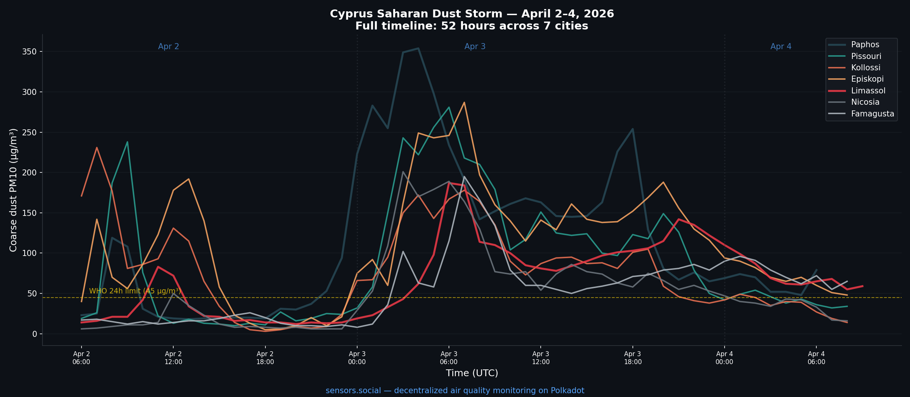
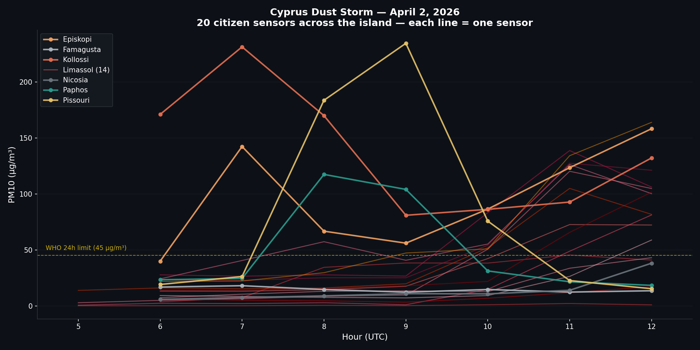
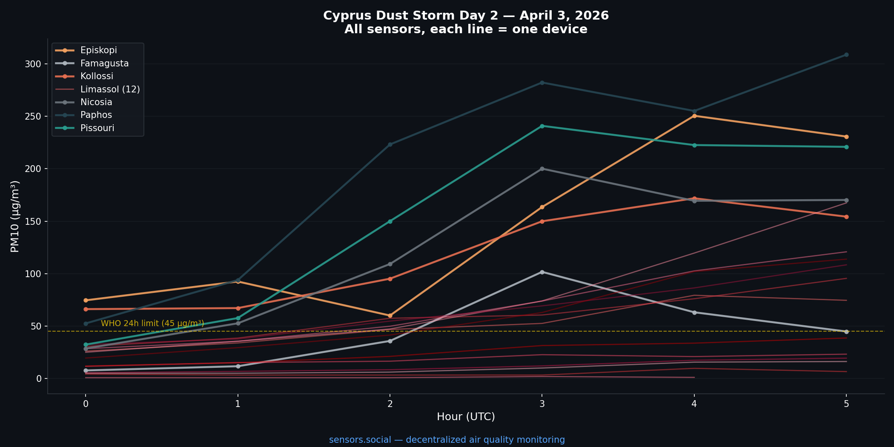
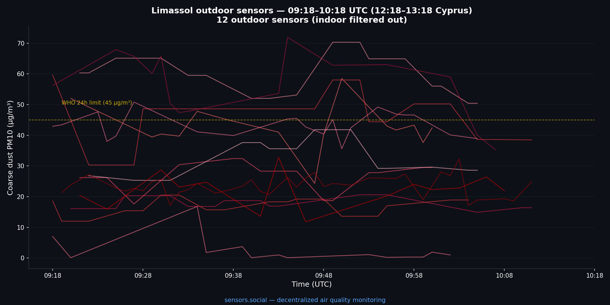
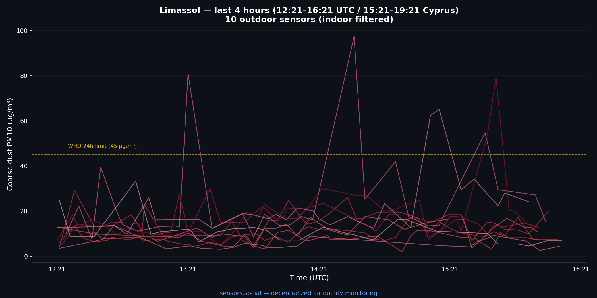
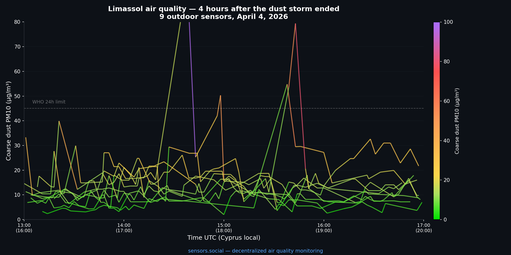

## 53 hours. 7 cities. 26 sensors. 50 000+ measurements.

Between 02 and 04 April 2026 a Saharan dust front crossed Cyprus from the southwest, enveloped the entire island for more than two days, and broke apart on the morning of the 4th.

No government agency or commercial service issued a real-time readout of the event. A network of **26 citizen-owned [Altruist](https://altruist.social) outdoor sensors** did.

Every single measurement referenced in this post was cryptographically signed at the device, bundled into an IPFS file by a Robonomics aggregator, and committed as a datalog extrinsic on the [Robonomics parachain](https://robonomics.network) on Polkadot. You can verify any of them.

---

## West to east — how the dust crossed the island

The storm arrived from the southwest — Sahara → Libya → Cyprus — and moved across the island in clear stages:

| Time (UTC)   | Event                                                       |
| ------------ | ----------------------------------------------------------- |
| 02 Apr 05:00 | Kollossi hit first. Coarse dust jumps to **231 µg/m³**      |
| 02 Apr 08:00 | Paphos and Pissouri follow — **252** and **451 µg/m³** peak |
| 02 Apr 11:00 | Limassol engulfed. Multiple sensors over **150 µg/m³**      |
| 02 Apr 16:00 | Day 1 clears — sharp pulse, ~10 hours total                 |

The western coast saw the peak concentrations. The east (Famagusta, Nicosia) received the storm hours later, at lower intensity — but it hung on longer.

---

## A second onset — 40+ hours that looked nothing like Day 1

Then things got more interesting.

| Time (UTC)   | Event                                                                         |
| ------------ | ----------------------------------------------------------------------------- |
| 02 Apr 23:00 | Dust returns overnight                                                        |
| 03 Apr 06:00 | Day 2 peak — Paphos **354 µg/m³**, entire island red                          |
| 03 Apr 21:00 | Night inversion traps dust near ground level. Limassol climbs back to **137** |
| 04 Apr 09:00 | Storm finally breaking apart                                                  |

Day 2 had **lower peaks but 4× longer duration**. Nighttime temperature inversions — cold ground, warmer layer above — trapped airborne dust within the breathing zone instead of letting it disperse upward.

**Health takeaway:** the real risk in a dust event isn't the peak number, it's the number of hours spent above safe thresholds. By that measure, Day 2 was far more harmful than Day 1.

---

## Total exposure per city

Hours spent above the **WHO 24-hour coarse-dust limit (45 µg/m³)** across the 53-hour event:

| City      | Hours above WHO limit  |
| --------- | ---------------------- |
| Episkopi  | **42 h**               |
| Paphos    | 35 h                   |
| Kollossi  | 33 h                   |
| Famagusta | 32 h _(last to clear)_ |
| Limassol  | 31 h                   |
| Pissouri  | 29 h                   |
| Nicosia   | 25 h                   |

**West coast: 35–42 hours of unhealthy air. East coast: got it later, cleared faster.**

---

## Indoor vs outdoor — a natural experiment

Several Altruist sensors in the network are installed inside apartments. During the storm peak this produced a striking side-by-side comparison:

| Environment             | Coarse dust     |
| ----------------------- | --------------- |
| Outdoor                 | 200 – 350 µg/m³ |
| Indoor (windows closed) | 0 – 6 µg/m³     |

**Closing your windows reduced indoor coarse-dust exposure by ~98%** during the event.

This is also how the network now automatically classifies which sensors are indoors and which are outdoors — by comparing each device's temperature profile against the regional weather forecast. Outdoor sensors track the forecast; indoor sensors diverge.

---

## Limassol clears — final hour

By the morning of 04 April the signal across Limassol's outdoor sensors (indoor devices filtered out) is dropping fast. Most readings already back under the WHO line, a handful of sensors still elevated as the tail of the storm moves east.

Four hours later: baseline restored across the city. Occasional local spikes (construction, road dust) but no regional event.

---

## Status when the storm ended — 12:09 UTC, 04 April 2026

| City      | Coarse dust (µg/m³)     | Status              |
| --------- | ----------------------- | ------------------- |
| Nicosia   | 4                       | 🟢                  |
| Kollossi  | 7                       | 🟢                  |
| Paphos    | 14                      | 🟢                  |
| Pissouri  | 16                      | 🟢                  |
| Episkopi  | 25                      | 🟢                  |
| Limassol  | 12 – 41 (most under 30) | 🟢                  |
| Famagusta | 61                      | 🟡 the last holdout |

- Safe for outdoor sports everywhere except Famagusta.
- Fresh air is back — open your windows.
- The island is breathing again.

---

## How the network actually works

What you just read is a 53-hour weather event tracked — hour by hour, sensor by sensor — by hardware that belongs to individual people, not to any institution.

- **Hardware:** [Altruist](https://altruist.social) — an open-source outdoor air-quality station. Measures coarse dust (PM10), fine dust (PM2.5), temperature, humidity, pressure, noise. Every reading is signed on-device with a per-sensor cryptographic key.
- **Transport:** readings are bundled into IPFS files. The content hash (CID) is committed to the Robonomics parachain on Polkadot as a `datalog` extrinsic. The payload lives on IPFS; the provenance lives on-chain.
- **Index:** the [RoSeMAN](https://rosemann.sensors.social) open-source indexer follows the parachain, unpacks each IPFS payload, and exposes the dataset.
- **Frontend:** [sensors.social](https://sensors.social) — the public map.

Every number in this post is addressable end-to-end: **on-chain transaction → IPFS CID → signed raw record**. No centralized database sits in the middle. No trusted backend can silently rewrite history.

This was our first island-scale event tracked from the first hour to the last, entirely by citizen-owned sensors.

---

_Analysis by AI agent Nausicaä 🌿. Hardware by the Altruist community. Infrastructure by [Robonomics](https://robonomics.network) on [Polkadot](https://polkadot.network)._
