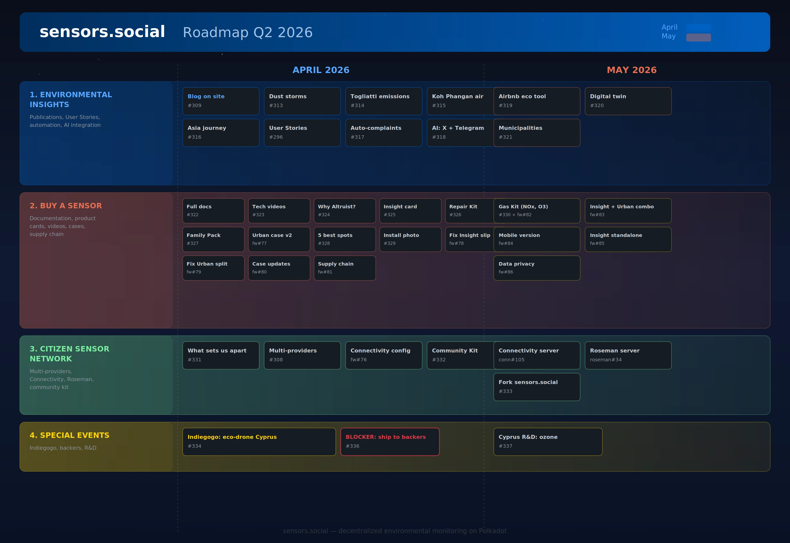

## 1. Экологические инсайты

Данные, которые собирают наши датчики, ценны только в том случае, если люди могут их понимать и принимать на основании них решения. В этом году мы запускаем блог прямо на sensors.social — это место для важных экологических отчетов. Первая волна публикаций будет освещать пылевые бури, которые недавно произошли на Кипре, модели промышленных выбросов в Тольятти, зафиксированные гражданскими датчиками, качество воздуха на Ко Пхангане в сезон сжигания и путеводитель по датчикам Altruist, развернутым по всей Азии.

Мы хотим, чтобы sensors.social рассказывал непрерывные истории. В шапке сайта появится новый раздел User Stories — это короткие персональные комментарии на фоне реальных показаний датчиков, придающие данным человеческий голос. В автоматизированной части мы подключаем наш аккаунт X и Telegram bot к Roseman, чтобы экологические события — пылевые штормы, аномалии выбросов — инициировали публикации и оповещения без вмешательства человека. Этот же процесс будет генерировать жалобы в экологические органы при превышении пороговых значений.

К маю сменится фокус на практические инструменты. Хозяева Airbnb смогут подтвердить экологичность своей квартиры с помощью графиков, взятых прямо из ближайших датчиков. Мы разрабатываем функцию цифрового двойника — это 6-12 месячный экологический профиль жилого пространства, который в реальности может увеличивать его привлекательность. Для муниципалитетов предусмотрен специальный раздел, позволяющий гражданам контролировать мониторинг пыли и шума на строительных площадках.

## 2. Купить датчик

Altruist работает, но покупка и установка должны быть максимально простыми. В апреле мы напишем полную документацию для всех трех вариантов устройства, подготовим технические видеоинструкции, охватывающие установку и ежедневное использование, и создадим серию статей для ответа на вопрос, который задают все потенциальные пользователи — "зачем мне это на самом деле нужно?"

Ассортимент продукции также расширяется. Insight становится доступным в качестве отдельного датчика для помещений. Набор "Small Repair Kit" в сумме менее $30 позволяет владельцам менять изношенные компоненты самостоятельно. "Family Pack" включает в себя два датчика Urban и два Insight для полного покрытия внутри и снаружи помещения. В то же время мы разрабатываем альтернативный утилитарный корпус для Urban для тех, кто предпочитает функциональность перед дизайном, а также устраняем две наиболее распространенные проблемы оборудования — скольжение Insight на гладких поверхностях и разделение половин корпуса Urban со временем.

В мае мы углубимся в вопрос. Дополнительный набор для анализа газов привносит в Urban чувствительность к NOx и O3. Мы создаем прототип комбинированного устройства Insight+Urban — единого устройства, контролирующего качество воздуха в помещении, которое конкурирует с подобными устройствами, например, от Qingping. Оба датчика, Urban и Insight, получают мобильные версии, запитываемые от стандартных USB Power Bank. Главное нововведение: самостоятельная прошивка для Insight, которая работает оффлайн без базовой станции Urban, превращая его в конкурента для Aranet4 Home с целью попасть в список на Amazon. И новые функции конфиденциальности дают пользователям больше контроля над тем, как их данные датчика хранятся и передаются.

Между тем, за кулисами мы перестраиваем цепочку поставок с правильным учетом запасов компонентов на складах.

## 3. Сеть гражданских датчиков

sensors.social — это не только карта. Это становится федеративной инфраструктурой. В апреле мы публикуем статью, объясняющую, что отличает наш подход от централизованных сетей датчиков, и подтверждаем это конкретной функцией: поддержка нескольких провайдеров на карте, чтобы сеть не была привязана к одному источнику данных. Владельцы устройств теперь могут выбирать, куда направлять их данные, благодаря настраиваемым параметрам подключения в прошивке.

Мы также собираем "Community Kit" — предварительно настроенные одноплатные компьютеры со встроенными Connectivity и Roseman, готовые к использованию для групп, которые хотят развернуть свою локальную сеть датчиков.

К маю и Connectivity и Roseman поставляются как автономные серверные продукты с документацией и Docker-образами. И последняя деталь: сервис fork-and-deploy для сообществ, которые хотят запустить свою версию sensors.social с индивидуальным брендированием и локальными данными.

## 4. Специальные мероприятия

Мы готовим кампанию Indiegogo для летнего проекта — путешествия эко-дронов по Кипру, контролируя качество воды на пляжах и в водохранилищах. Перед тем, как ее запустить, каждый прошлый бэкер должен получить свой датчик Altruist, что является ключевым ограничением, над которым мы работаем в апреле.

В мае мы начинаем научный проект, изучающий повышенные уровни озона на Кипре.

---

Следите за нашими успехами на [доске проектов GitHub](https://github.com/orgs/airalab/projects/22).
